# תהליך העריכה להבא — SHIRASHEMI

עודכן ב־22.09.2026. התרשים מתאר את סדר העבודה הרצוי; שלבים מסומנים כ״עתידי״ טרם מומשו. השינויים הנוכחיים הם ב־Classic בלבד.

הכפתור החדש **Full Auto Edit** בלשונית AI מחבר את התהליך לפרויקט יחיד אחרי ייבוא וידאו. לפני ההרצה בוחרים בנפרד אפס עד ארבע תוספות: **Automatic Zoom**, **Automatic Transition Edit**, **Automatic Word Animation and Reveal**, **Automatic Music**. ההדגשות האחרונות מוגבלות לעד 10% מהסרטון; Letter by Letter נדיר במיוחד. Batch בעמוד Projects יתווסף רק לאחר אישור המשתמש שהזרימה לפרויקט יחיד עובדת כרצונו.

תוקן trimming של קליפ במסלול הראשי: קיצור מההתחלה או מהסוף סוגר את הזמן שהוסר ומזיז את השכבות הבאות; הארכה מזיזה אותן קדימה. אפקטים שחוצים את העריכה וחותמות הזמן של הכתוביות מותאמים, וכל הגרירה ניתנת לביטול בפעולת Undo אחת. יש לבדוק ידנית גבולות דיבור אחרי הסרת השקט ולהחזיר הברות שנחתכו לפני אישור הייצוא.

```mermaid
flowchart TD
    A["ייבוא המקור לפרויקט נפרד"] --> B["Vertical 9:16 · Fill / Cover<br/>ללא שוליים שחורים"]
    B --> C["זיהוי פנים וגוף מקומי עם OpenCV + Pose<br/>ללא בקשת LLM או ענן<br/>מרכוז אופקי יציב לפני הסרת השקט"]
    C --> D["Remove Silences · 0.3"]
    D --> E["הכנה לפני תמלול<br/>ivrit-ai Whisper large-v3 · Hebrew<br/>Rows = 1 · Words per row = 4"]
    E --> F["Auto Texts — הפעלה אחת"]
    subgraph AUTO["השלבים בתוך Auto Texts"]
      F --> G["תמלול"]
      G --> H["Codex Correct"]
      H --> I["Rearrange Rows"]
      I --> J["Apply & Arrange All Text<br/>כולל שלב Transitions"]
    end
    J --> K["בקרת תוכן ותזמון מול הדיבור<br/>ללא השמטות, כפילויות או ריבוי שכבות שגוי"]
    K --> L{"התוכן מלא ונכון?"}
    L -- "לא" --> M["תיקון ממוקד לפי המקור<br/>מיפוי הזמנים דרך חיתוכי השקט"]
    M --> K
    L -- "כן" --> N["כתוביות במרכז המסך · שורה אחת<br/>Hide Punctuation = ON<br/>Bottom Fade Out = 60%<br/>Fade Out End Opacity = 25%"]
    N --> O["פונט Assistant מודגש מ־Custom Fonts<br/>וידאו מתחת לשכבות הטקסט"]
    O --> P["Editorial Edge Feather שחור<br/>למעלה ולמטה, לאורך כל הטיימליין"]
    P --> Z{"התוספות שנבחרו לפני ההרצה"}
    Z --> Z1["אופציונלי: Automatic Zoom"]
    Z1 --> Z2["אופציונלי: Automatic Transition Edit"]
    Z2 --> Z3["אופציונלי: Automatic Word Animation and Reveal<br/>עד 10% · Letter by Letter חריג בלבד"]
    Z3 --> Z4["אופציונלי: Automatic Music<br/>ספריית Music בלבד · לפחות כאורך הסרטון<br/>חיתוך לסוף הווידאו · ‎−28 dB"]
    Z4 --> Q["שמירה ובדיקת המשתמש<br/>תמלול מלא, גבולות מילים, פנים בפריים, קריאות"]
    Q --> R["ייצוא רק אחרי בדיקה ואישור"]
    Q --> S{"אישור שהתהליך האוטומטי הצליח"}
    S -- "כן" --> W["BATCH בעמוד Projects<br/>בחירת סרטונים וארבע תוספות אופציונליות"]
    W --> X["פרויקט לכל סרטון · עיבוד ברקע<br/>פרויקטים פעילים נעולים לעריכה<br/>צפייה בשינויים בזמן אמת · שאר האפליקציה זמינה"]
```

## הלקחים שהוכנסו לתהליך

- **Rows = 1 לפני התמלול.** זו מספר השורות בכל כתובית, לא מספר שכבות הטיימליין. בדרך כלל מספיקות שכבה אחת או שתיים; חפיפות אמיתיות עשויות לדרוש יותר. תוקן שימוש חוזר בשכבות שהתפנו במקום פתיחת עוד ועוד שכבות.
- **המודל הוא ivrit-ai Whisper large-v3.** סוננו ניסיונות פענוח כושלים בעלי מקטע באורך אפס שיצרו מילים כפולות; טוקנים באורך אפס בתוך מקטע תקין נשמרים.
- **משתמשים ב־Auto Texts המלא.** Codex Correct ו־Rearrange Rows הם כבר שלבים בתוכו; אין להפעיל אותם שוב אוטומטית אחריו. שלב Apply & Arrange All Text כלול, אך אינו מבטיח שייווצר מעבר בכל כתובית כשאין חפיפה מתאימה.
- **הודעת הצלחה אינה הוכחה שהתמלול מלא.** בסבב הזה הושלמו השמטות בסרטונים 1, 4 ו־8 לפי המקור. בעיית ההשמטות הכללית עדיין דורשת טיפול במנוע; אסור להמציא ניסוח במקום דיבור חסר.
- **הסתרת פיסוק היא תצוגה.** הטקסט המוצג ו־word runs נקיים מפיסוק; מילות תמלול המקור נשמרות. מיקום מרכזי, הסתרת פיסוק וערכי 60% / 25% הם ברירות המחדל החדשות לכתוביות שנוצרות. הגדרות מפורשות ופריסטים שמורים יכולים לעקוף ברירות מחדל.
- **פונט:** הבקשה היא Assistant Bold. כרגע קיים ב־Custom Fonts הפריט Assistant ExtraBold, והוא שהוחל בכל השמונה; אין להציג אותו כאילו היה פריט נפרד בשם Assistant Bold.
- **סדר שכבות:** כתוביות למעלה, אפקט העננה מתחתיהן, וידאו מתחת לאפקט. האפקט צריך לכסות את כל משך הסרטון אחרי הסרת השקט.
- **בדיקה חזותית:** לוודא שורה אחת בפועל, טקסט גלוי וקריא, פנים בפריים, וללא שוליים שחורים. בסרטון 5 פוצלה כתובית ארוכה כדי לשמור על שורה אחת.
- **מרכוז פנים וגוף לפני הסרת השקט:** זיהוי מקומי בחמישה פריימים לא חתוכים מהמקור וחיתוך יציב עם גבולות Cover. סינון זיהויים כפולים ובדיקת עקביות בין הדגימות. כשיש זיהוי גוף עליון אמין הוא משוקלל; אחרת המרכוז נשען על הפנים. זו אינה עקיבה רציפה; תנועה גדולה, כמה אנשים או חוסר ודאות עוצרים לבדיקה. חובה לבדוק גם רגעים שלא נדגמו.

## מצב הסבב הנוכחי

שמונת הפרויקטים נשמרו. בכל 221 הטקסטים: מרכז המסך, Bottom Fade Out ‏60%, Fade Out End Opacity ‏25%, Hide Punctuation פעיל. נשמרו התזמונים, הפונט, חיתוכי הווידאו והאפקטים. לא בוצע ייצוא.

[פתיחת רשימת שמונת הפרויקטים והערות הבדיקה](./SHIRASHEMI-EDIT-REVIEW.md)

## Automatic Zoom — 22.09.2026

נוסף כפתור Automatic Zoom בלשונית AI, עם סקיל שקודקס טוען בפועל, קוד הטיימליין המלא, תמלול ופריימים לדוגמה. נוצרת שכבת אפקט נפרדת מעל הווידאו ומתחת לכתוביות, ללא Overlay Movements. בחלק מהזומים החדים מוצמד סוויש לפי כלל קבוע. [מימוש, מחקר ובדיקות](./AUTOMATIC-ZOOM.md).

Automatic Zoom, Automatic Transitions, Automatic Word Animation and Reveal ו־Automatic Music מחוברים ל־Full Auto Edit לפרויקט יחיד ול־Batch בעמוד Projects. לכל סרטון נוצר פרויקט נפרד עם ארבע האפשרויות, עיבוד ברקע, נעילה לעריכה וצפייה בשינויים שנשמרו. בקר התקדמות צף ונגרר מציג שלבים וסרטונים שהושלמו. יש להשאיר את טאב האפליקציה פתוח בזמן העבודה. [מימוש ומגבלות Batch](./BATCH-FULL-AUTO-EDIT.md).

[מימוש, מגבלות ובדיקות Full Auto Edit](./AUTOMATIC-WORD-ANIMATION-AND-FULL-EDIT.md)

הערת סביבת עבודה: בבדיקה הנוכחית Whisper על CUDA הגיע ל־timeout. הוגדר מקומית `WHISPER_CPP_DEVICE=cpu`; המודל נשאר ivrit-ai large-v3 ותזמון DTW נשמר. בדיקת התוכן והגבולות שבתרשים היא חלק מבקרת המשתמש לפני ייצוא, ולא הבטחה לזיהוי אוטומטי של כל טעות תמלול.

בדיקת Full Auto Edit לפרויקט יחיד הסתיימה בהצלחה עם שלוש האפשרויות מסומנות. פרויקט הבדיקה `Full Auto Edit - QA - Short6` נשמר ונשאר פתוח לביקורת. ה־AI בחר במקרה הזה שלא להוסיף Word Animation או Reveal נוסף; זו תוצאה תקינה של מדיניות ההדגשות הנדירות. לא בוצע ייצוא.

## Automatic Music

נוסף כפתור עצמאי ו־checkbox רביעי ב־Full Auto Edit. בחירה לפי תוכן הסרטון ושמות/קטגוריות כל ספריית Music, מתוך מנגינות שאורכן לפחות כאורך הווידאו. המוזיקה מתחילה ב־0, נחתכת בסוף הסרטון ומוגדרת ל־‎−28 dB. אין לולאה או מתיחה של שיר קצר. אם אין מנגינה מתאימה באורך הנדרש, מדלגים עם הודעה. אותה אפשרות נכללת בחוזה ההגדרות ל־Batch. [מימוש ובדיקות](./AUTOMATIC-MUSIC.md).

המרכוז ב־Full Auto Edit משתמש כעת בזיהוי מקומי בלבד. להפעלה חוזרת על פרויקט ערוך נוסף הכפתור **Center Subject Horizontally**; הוא משנה רק Position X ושומר את שאר העריכה. [מנגנון מקומי ובדיקות](./LOCAL-SUBJECT-FRAMING.md).
